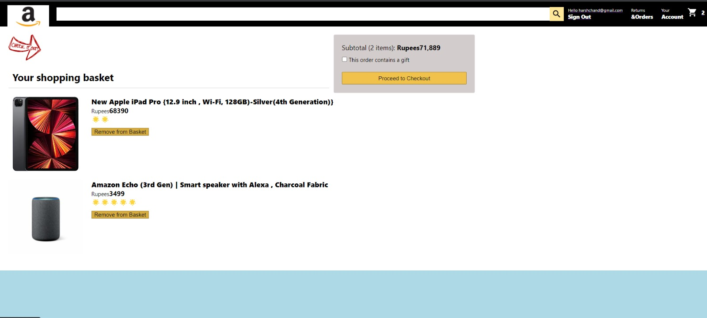
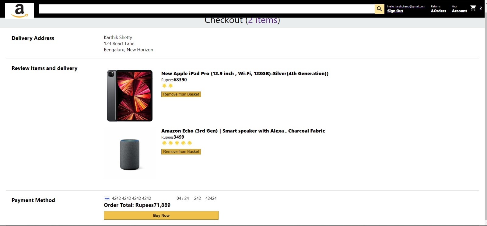

 This is my amazon clone called Go__Kart
 React frontend,
 Firebase backend,
 Stripe payment functionality 
Log-In credentials are authorized by firebase and as you can see the card number can be detected if it is valid through stripe payment
 #Log-IN / Sign-UP PAGE

#Home page

#Basket page

#Checkout/Payment Page

